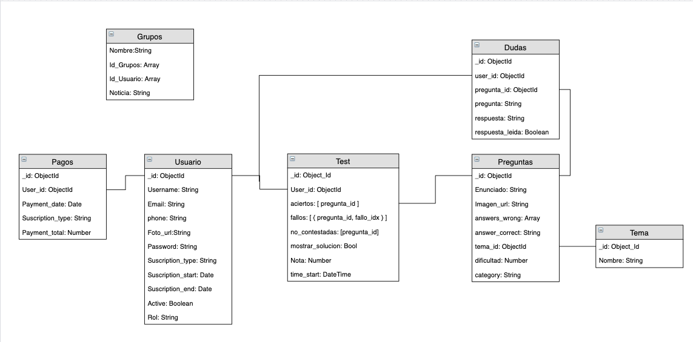

## Database Structure



## General Endpoints
```bash
Home    —> ./
Login   —> ./login
Signup  —> ./signup
```

## User endpoints
```bash
u. profile         —> ./user/:id (get)
u. profile         —> ./user/:id (patch)

u. new test        —> ./tests (post)
u. test list       —> ./tests?userId=user_id (get)
u. test show       —> ./tests/:id  (get)
u. test show       —> ./tests/:id  (patch)  { aciertos : [1, 2, 3]    }
u. question        —> ./questions/:question_id (get)

u. messages list   —> ./messages?userId=fico (get)
u. message show    —> ./messages/:id (get)
u. message         —> ./messages (post)
```

## Admin endpoints
```bash
a. profile         —> ./admin/:id (get)
a. profile         —> ./admin/:id (patch)

a. new test        —> ./tests (post)
a. test list       —> ./tests?userId=user_id (get)

a. show test       —> ./tests/:id  (get)
a. delete test     —> ./tests/:id  (delete)
a. update test     —> ./tests/:id  (patch)

a. questions list  —>./questions (get)
a. new question    —> ./questions (post)
a. question show   —> ./questions/:id (get)
a. question show   —> ./questions/:id (patch)

a. messages list   —> .messages (get)
a. message show    —> message/:message_id (get)
a. message         —> message/:message_id (patch)


a. payments list   —> ./payments (post) #//revisar
a. payments list   —> ./payments (get)  #//revisar

a. payment         —> ./payment/:id (post) #//revisar
a. payment         —> ./payment/:id (get) #//revisar
```